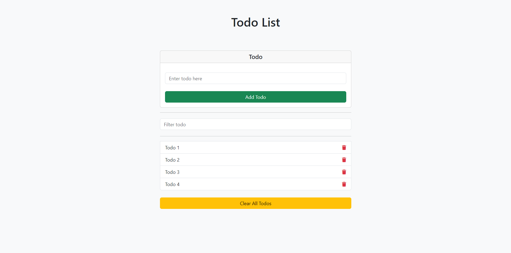

# JavaScript Todo App

This is a simple JavaScript Todo App that allows users to add, delete, filter and clear todos. This project at the same time stores your data in the Local Storage.

## Getting Started

Clone the repository and open `index.html` in your browser.

    git clone https://github.com/yusufasur/javascript-todo-app.git

## Usage

The app allows you to perform the following actions:

-   Add a todo by typing in the input field and pressing the `Enter` key or clicking the `Add` button.
-   Delete a todo by clicking the trash icon next to it.
-   Filter todos by typing in the filter input field.
-   Clear all todos by clicking the `Clear Todos` button.

## Built With

-   HTML
-   CSS
-   JavaScript

## License

This project is licensed under the [MIT License](https://opensource.org/license/mit/)
